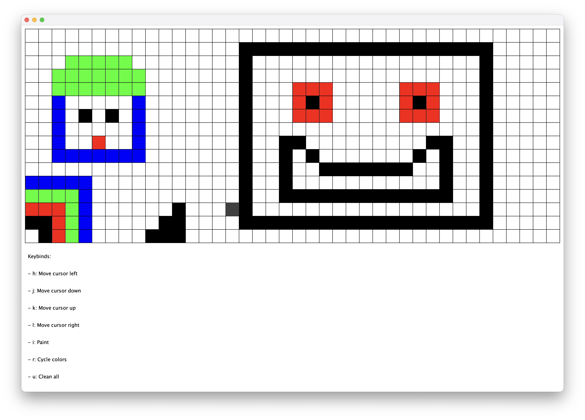

# mapEditor

This is a simple Java program that functions as a map editor, allowing users to create and edit a grid of colored blocks. The program uses the SimpleGraphics library to handle graphics and keyboard input.
<br>
The user can move a cursor around the grid using Vim-like keybinds, and can paint new blocks using the 'i' key. The color of the blocks can be cycled through using the 'r' key, and all blocks can be deleted using the 'u' key.
<br>
The program also displays a set of keybinds at the bottom of the screen, which can be used as a reference for the user.
<br>
Overall, this program provides a simple and intuitive interface for creating and editing a grid of colored blocks.

## Keybinds 

- **h:** Move cursor left
- **j:** Move cursor down
- **k:** Move cursor up
- **l:** Move cursor right
- **i:** Paint
- **r:** Cycle colors
- **u:** Clean all 

## Image



## Usage

1. Clone the repository.
2. Compile the Java files.
3. Run the mapEditor.

**OR**

1. Clone the repository.
2. Open the project directly from your preferred editor.
3. Have fun changing the code to your liking. (e.g. cursor size, paint color, keybinds etc.)
4. Run the project after you are done.

## Snippet of code

```java
    private void createCursor() {
        cursorRectangle = new Rectangle(PADDING, PADDING, customWidth, customHeight);
        cursorRectangle.setColor(CURSOR_COLOR);
        cursorRectangle.draw();
        cursorRectangle.fill();
        }
```
